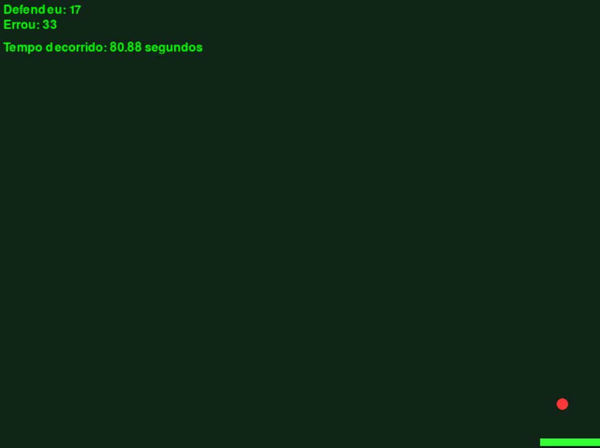

# IA Pong
AI playing pong

pt-br:

Neste projeto, tenho o objetivo de fazer uma breve introdução a criação de redes neurais com numpy.
Aqui podemos ver como:

- Criar um jogo do Pong;
- Criar um rede neural simples;
- Criar arquivos de dados;
- Criar um banco de dados SQLite para salvar os resultados;

Uma forma simples de entender como criar e como explorar mais sobre aprendizagem por reforço em games.

---

en-us:

In this project, my goal is to provide a brief introduction to creating neural networks using numpy. Here we can see how:

- Create a Pong game;
- Create a simple neural network;
- Create data files;
- Create SQLite database to save the results;
A straightforward way to understand how to create and further explore reinforcement learning in games.

## AI is playing

## Database Control
